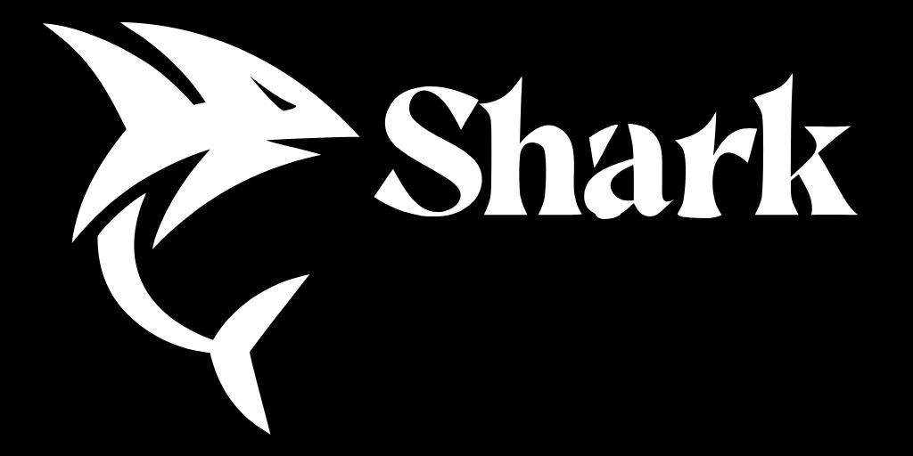
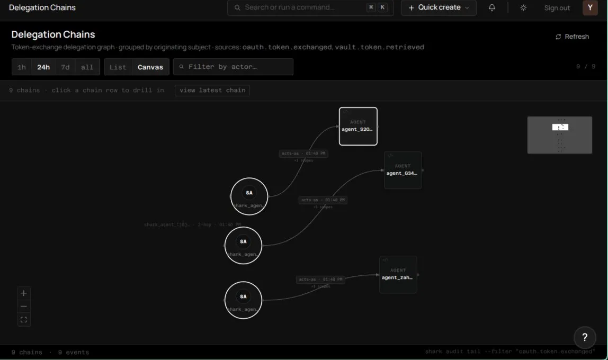
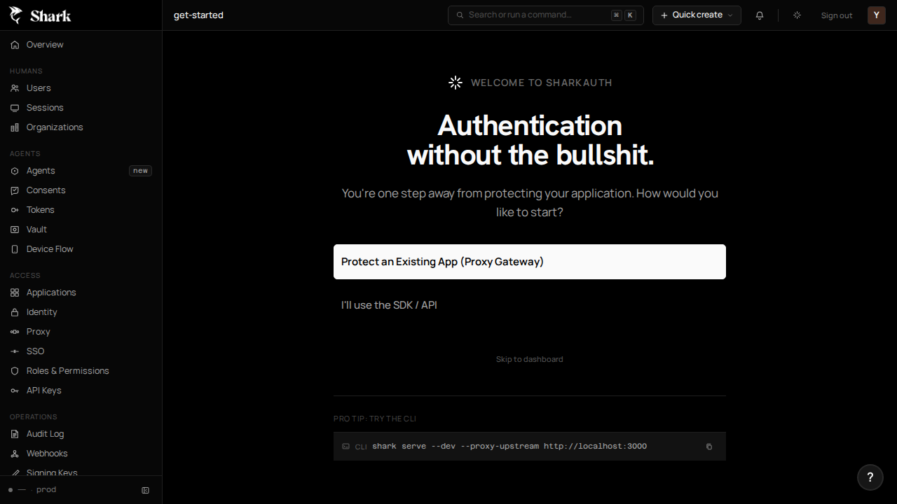

<p align="center">
  
</p>

<h1 align="center">SharkAuth</h1>

<p align="center">
  <strong>The first open-source identity platform built for the agentic world.</strong><br />
  Real Delegation. RFC 9449 DPoP. Unified Audit Trails. One ~40MB binary.
</p>

<p align="center">
  <a href="https://github.com/shark-auth/shark/releases/latest"></a>
  <a href="LICENSE"></a>
  <a href="#"></a>
  <a href="#"></a>
</p>

---

## Software has users. Now software has agents.

Auth systems built in the 2010s were designed for humans, sessions, and simple apps. They weren't built for chains of AI agents acting on behalf of users.

When an agent delegates to a sub-agent, the trust chain usually breaks. You lose visibility, bearer tokens leak, and revocation becomes a hot mess without an auth stack that is built for this exact scenario.

**SharkAuth fixes this.** It treats agents as first-class identities with native delegation primitives, proof-of-possession tokens, and a unified audit trail that tracks every hop from user to resource.

### One binary, Zero Config.

```bash
# 1. Install (Go 1.22+)
go install github.com/shark-auth/shark/cmd/shark@latest

# 2. Boot. SQLite-embedded, migrations apply instantly.
shark serve
# => admin UI : http://localhost:8080/admin
# => issuer   : http://localhost:8080
```

---

## Why SharkAuth

### 1. Agent Delegation is First-Class

Real delegated authority using **RFC 8693 Token Exchange**. Shark issues `may_act_grants` that are revocable, time-limited, and hop-constrained. No more prompt-level "trust me" delegation.

<p align="center">
  
  <br /><em>Audit every hop in the chain: User → Researcher → Tool Agent.</em>
</p>

### 2. DPoP-Bound Security (RFC 9449)

Bearer tokens are a liability. Shark ships **Demonstrating Proof-of-Possession** by default. Tokens are cryptographically bound to the agent's private key. If a token is stolen via prompt injection or log leak, it’s useless without the key.

### 3. Unified Audit Trails

One `grant_id` correlates every token, every hop, and every resource touched. Reconstruct the full lifecycle of an agent's authority in one query.

### 4. Zero Infrastructure Overhead

Shark is a single ~30MB Go binary. No Postgres, no Redis, no Docker required. It runs on a Raspberry Pi as easily as it runs on a Kubernetes cluster.

### 5. Human Auth is Table Stakes

Shark ships with all human auth primitives: Passkeys (FIDO2), Magic Links, MFA (TOTP), Enterprise SSO (SAML 2.0, OIDC) in beta and are rapidly improving.

### 6. Beautiful Admin Dashboard

## Shark ships with a built-in React admin dashboard that allows you to manage all of your users, tokens, and grants.

## Features

| Category       | Highlights                                                                                                             |
| :------------- | :--------------------------------------------------------------------------------------------------------------------- |
| **Agent Auth** | RFC 8693 Token Exchange, RFC 9449 DPoP, `may_act_grants`, Token Vault (Google, Slack, GitHub), Device Flow (RFC 8628). |
| **Human Auth** | Passkeys (FIDO2), Magic Links, MFA (TOTP), Enterprise SSO (SAML 2.0, OIDC), Argon2id passwords.                        |
| **Platform**   | Multi-tenant Organizations, Wildcard RBAC (`users:*`), Webhooks (HMAC-signed), Audit Logs (CSV export).                |
| **Admin UI**   | Beautiful React-based dashboard embedded in the binary. One-click revocation for every session, token, and grant.      |

> [!TIP]
> Check out [sharkauth.com/docs](https://sharkauth.com/docs) for the full API reference and integration guides.

---

## Battle-Ready Admin UI

SharkAuth isn't just an API. It's a full-featured management system.

<p align="center">
  
</p>

---

## Competitive Comparison

| Feature                     | **SharkAuth** | Auth0 | Clerk | Ory / Hydra  |
| :-------------------------- | :-----------: | :---: | :---: | :----------: |
| **Agent-Native Primitives** |    **Yes**    |  No   |  No   |   Partial    |
| **Native DPoP Support**     |    **Yes**    |  Yes  |  No   |      No      |
| **Self-Hosted (OSS)**       |    **MIT**    |  No   |  No   |  Apache 2.0  |
| **Single Binary**           |    **Yes**    |  --   |  --   | No (2+ svcs) |
| **Built-in Token Vault**    |    **Yes**    |  Yes  |  No   |      No      |
| **Price (Self-Hosted)**     |    **$0**     |  N/A  |  N/A  |      $0      |

---

## Roadmap: Built for 2026

We're moving fast. Here is what's coming next:

- **Zero-Code Auth Proxy**: A high-performance gateway to inject identity headers into any upstream app without changing a line of code.
- **Visual Flow Builder**: Drag-and-drop customization for complex auth flows (MFA → SSO → Org Select).
- **Advanced Revocation Patterns**: Pattern-based bulk revocation (e.g., "kill all tokens for this agent template").
- **Shark Email**: Email delivery service for magic links, MFA codes, and notifications.
- **Shark Agentic**: Management layer designed for AI agents to integrate your app with SharkAuth. No human coding, inspired by InsForge.
- **Shark Cloud**: Managed global infrastructure with plans ranging from free to enterprise.

---

## Quick Start

### Install via Docker

```bash
docker run -p 8080:8080 -v shark-data:/data ghcr.io/shark-auth/shark
```

### Dev Mode

```bash
shark serve --dev
```

No email config needed. Magic links print to stdout. In-memory database. Perfect for rapid prototyping.

### Integrate (TypeScript)

```typescript
import { SharkClient } from "@sharkauth/sdk";

const shark = new SharkClient({ baseUrl: "http://localhost:8080" });

// Sign in with DPoP protection
const session = await shark.signIn({ email: "alice@co.io", password: "..." });
```

---

## Community & Support

- **Discord**: [Join the conversation](https://discord.gg/sharkauth)
- **Twitter**: [@raulgooo](https://twitter.com/raulgooo)
- **Docs**: [sharkauth.com/docs](https://sharkauth.com/docs)

SharkAuth is MIT-licensed. Built by [Raúl](https://github.com/raulgooo) in Monterrey, Mexico.

---

<p align="center">
  <strong>If your product ships agents, the auth stack starts here.</strong>
</p>
