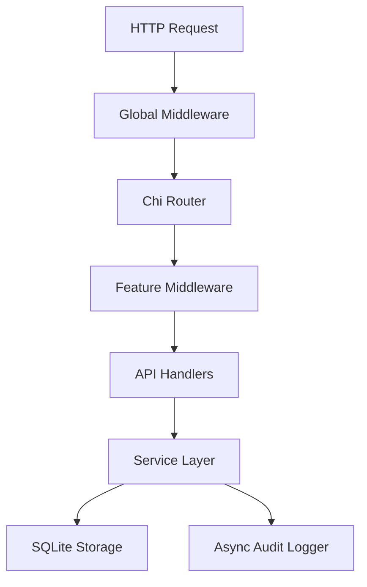

# SharkAuth Technical Summary

**SharkAuth** is a lightweight, modern, self-hosted authentication platform built in Go. It is designed as a single-binary replacement for complex managed services like Auth0 or Clerk, offering full feature parity with zero operational overhead.

---

## 🦈 What is SharkAuth?

Unlike traditional auth providers that charge per-user and lock you into their infrastructure, SharkAuth is a **fat binary** that embeds its own database (SQLite) and admin dashboard. It is "agent-native," meaning it treats AI agents as first-class identities with their own OAuth 2.1 credentials and audit trails.

### Core Value Proposition

- **Self-Hosted First**: $0 cost for unlimited users. You own your data.
- **Single Binary**: Everything (Go backend, React dashboard, SQLite DB) ships in one <30MB binary.
- **Agent-Ready**: Built-in support for MCP-native agents, OAuth 2.1 delegation, and a managed Token Vault.
- **Zero-Code Proxy**: Protect any backend service without writing a single line of auth code.

---

## 🛠 Technical Stack & Architecture

SharkAuth follows a clean, layered architecture designed for extreme performance and portability.

- **Language**: Go 1.25 (Standard library heavy).
- **Router**: [Chi v5](https://github.com/go-chi/chi) for high-performance HTTP routing.
- **Database**: SQLite with **WAL (Write-Ahead Logging)** mode for high concurrency.
- **Security**:
  - **Argon2id** for industry-standard password hashing.
  - **AES-256-GCM** for sensitive field encryption at rest.
  - **Constant-time comparisons** across all security-critical paths.
- **Standards**: FIDO2/WebAuthn (Passkeys), TOTP (MFA), SAML 2.0, OIDC, and OAuth 2.1.
- **Frontend**: Admin Dashboard built with React 18 + Vite + TypeScript, embedded via `go:embed`.

### Internal Architecture

---

## 🚀 Key Features

### 1. Modern Authentication

- **Multi-Method Login**: Support for Passwords, Magic Links, and Social OAuth (Google, GitHub, Apple, Discord).
- **Passkeys (WebAuthn)**: Phishing-resistant FIDO2 login.
- **MFA**: TOTP (Google Authenticator) with encrypted recovery codes.

### 2. Agent-Native Identity

- **OAuth 2.1 Authorization Server**: Full support for Authorization Code + PKCE, Client Credentials, and Device Flow.
- **Token Vault**: Securely manages OAuth tokens for third-party APIs (Slack, GitHub, Notion, etc.) on behalf of agents.
- **Delegation Chains**: Track "Agent B acting on behalf of Agent A on behalf of User Alice" with full audit integrity.

### 3. Zero-Code Identity Proxy

- Put Shark in front of any service using `--proxy-upstream`.
- **Identity Injection**: Shark injects `X-User-ID`, `X-User-Roles`, and `X-Agent-ID` headers into upstream requests.
- **Circuit Breaker**: Local JWKS caching ensures agents stay online even if the auth database is unreachable.

### 4. Enterprise & Observability

- **RBAC**: Fine-grained roles and permissions with wildcard matching (e.g., `projects:*:write`).
- **SSO**: SAML 2.0 and OIDC enterprise connections.
- **Audit Logs**: Comprehensive trail of every auth event, exportable to CSV with cursor-based pagination.

---

## 💻 Developer Experience

- **TypeScript SDK**: Isomorphic, zero-dependency fetch-based SDK (`@sharkauth/js`).
- **CLI Tool**: `shark init` and `shark serve` get you from zero to production in seconds.
- **Dev Mode**: `shark serve --dev` mounts an ephemeral DB and a local "Dev Inbox" for testing outbound emails.

---

_Created on 2026-04-21_
